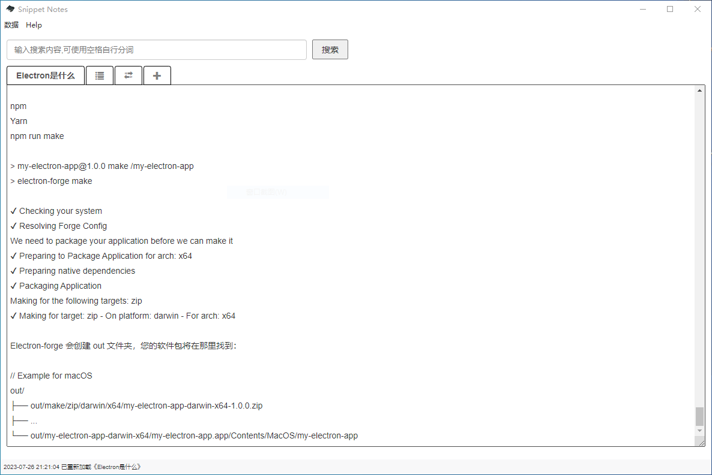
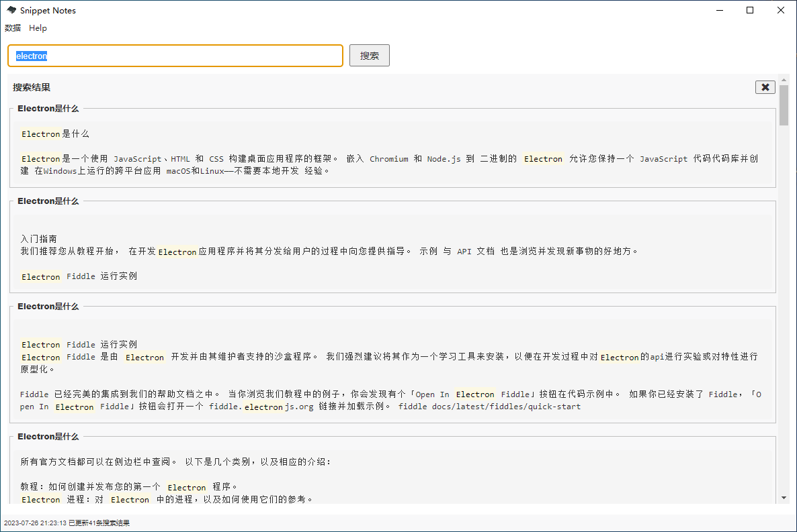

# snippet-notes

## 简介

效能笔记（Snippet Notes）是一款开源免费的本地笔记记录软件,与同类型笔记相比,对搜索及速记能力进行了着重优化。[ Snippet Notes is an open source and free local note-taking software, optimized for search and shorthand capabilities compared to similar types of notes tool.]

软件基于electron开发，遵循MIT开源协议。

## 使用

快速记录笔记，第一行将作为笔记名

 

使用全文检索引擎lunr.js对关键字进行全文检索，同一个笔记中的每一个匹配数据都将单独展示，大部分情况下可直接在搜索界面获得想要的数据，双击搜索结果可进入详情页，双击详情页可进入对内容进行编辑。

  

## 安装说明

1. 使用安装程序进行安装时会被360安全卫士误报告警（有程序试图修改应用关键程序及DLL），仔细看都是修改的本软件自己的库及文件，忽略即可。