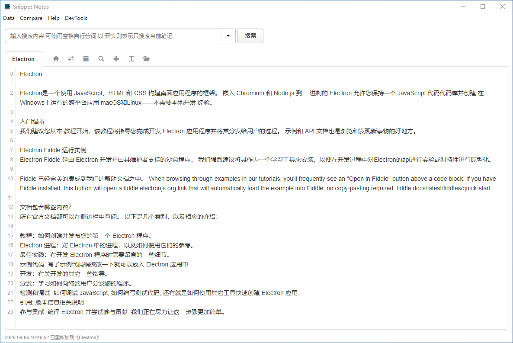
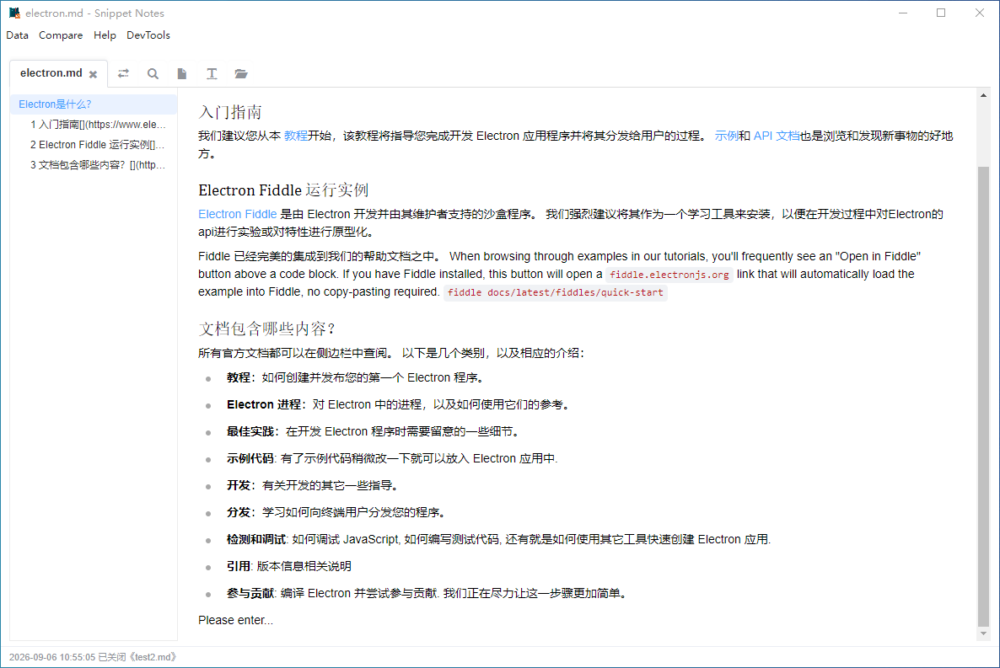
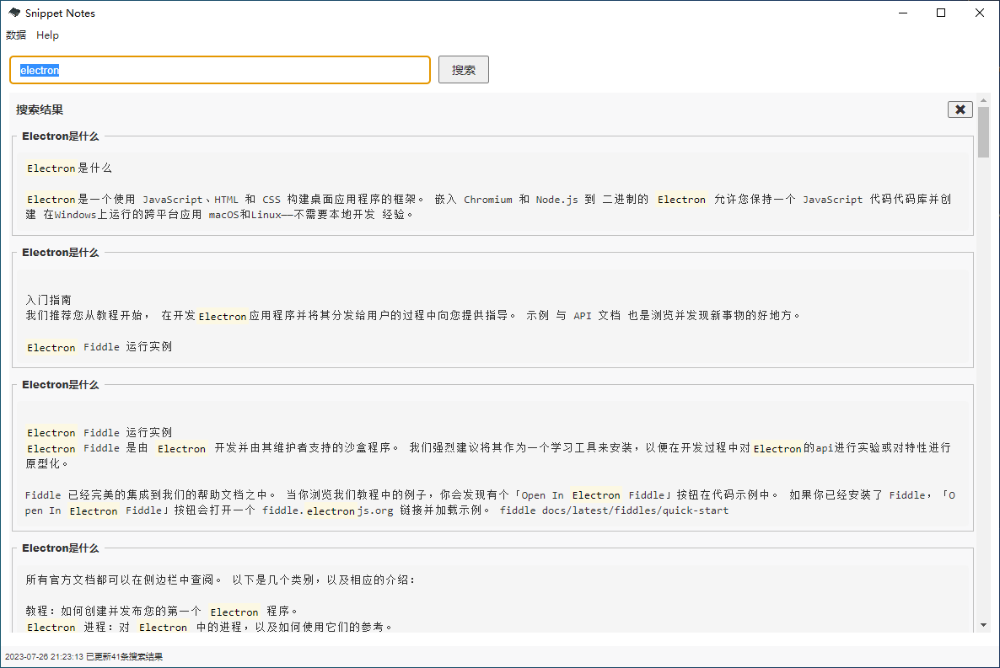

# snippet-notes

## 简介

效能笔记（Snippet Notes）是一款开源免费的本地笔记记录软件,与同类型笔记相比,对搜索及速记能力进行了着重优化,同时支持直接编辑本地 md 文档。\[ Snippet Notes is an open source and free local note-taking software, optimized for search and shorthand capabilities compared to similar types of notes tool, and also supports editing local md files directly.]

软件基于electron开发，遵循MIT开源协议。

提供windows及uos arm版本。

## 使用

对笔记进行快速记录，第一行将作为笔记名，如果笔记以#开头则将默认以markdown格式进行渲染及编辑。支持创建多个笔记，也可以直接把内容都记录到一个笔记中，对整体体验影响不大。




使用快捷键 Ctrl + f触发搜索，通过正则对关键字进行全文检索，同一个笔记中的每一个匹配数据都将单独展示，大部分情况下可直接在搜索界面获得想要的数据，双击搜索结果可进入详情页，双击详情页可进入对内容进行编辑。



## 本地 md 文档编辑

软件除了管理内置笔记外，还支持直接编辑本地 md 文档，可将其当作轻量 markdown 编辑器使用：

- **直接打开**：双击 .md 文件（设置为默认打开程序后）或命令行传入 .md 路径，即可用本软件打开编辑，保存内容写回原文件。
- **软件内打开**：在软件界面选择打开本地文件，可多选 md 文档。
- **新建文件**：可在任意目录新建空白 md 文档并打开编辑，未输入 .md 后缀时自动补全。
- **多进程隔离**：在笔记模式下打开本地文件时，会新开独立进程编辑，互不影响当前笔记界面，窗口标题以文件名区分。
- **自动格式化**：md 文档以 markdown 编辑器打开时，编辑器会对内容进行自动格式化（如补全末尾换行、统一空白等），可能与原文件内容存在差异，保存后文件内容会发生相应变更，未保存时界面会以 `*` 标记提示。

## 安装说明

推荐直接使用绿色版程序压缩包，解压即用。当使用安装程序进行安装时会被360安全卫士误告警 “有程序试图修改应用关键程序及DLL”，告警的提示中可见修改的都是本软件自己的库及文件，忽略即可。

## Windows 设置 md 文档默认打开方式

软件支持通过启动参数直接打开 md 文件（双击或命令行传入 .md 路径即可），可在 Windows 中将其设置为 md 文档的默认打开程序：

- **方式一（右键）**：右键点击任意 .md 文件 → 打开方式 → 选择其它应用 → 选择 `snippet-note-md.exe`（勾选"始终使用此应用打开 .md 文件"）→ 确定。

## 编译

### 快速编译

```bash
# 编译Windows平台
npm run dist

# 编译所有平台 (Windows, Linux x86, ARM)
bash pack.sh all
```

## 鸣谢

- electron
- sqlite3
- jquery
- milkdown (Crepe)

其他使用的开源社区产品参见 lib 及 package.json 的引用信息
